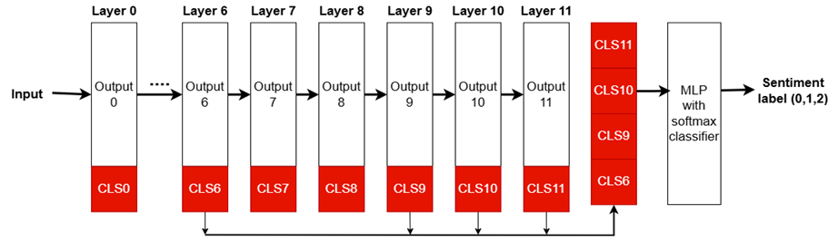

<div align="center" style="position: relative;">
<h1>Sentiment Analysis for Vietnamese Comments</h1>
</div>

##  Table of Contents

- [Overview](#overview)
- [Technologies Used](#technologies-used)
- [Features](#features)
- [ Getting Started](#getting-started)
  - [ Prerequisites](#prerequisites)
  - [ Installation](#installation)
- [Usage](#usage)
- [Usage](#usage)
  - [Fine-Tuning PhoBERT](#fine-tuning-phobert)
  - [Running the FastAPI Server](#running-the-fastapi-server)
- [ License](#-license)

---

##  Overview

Welcome to the Sentiment-Analysis-Comments project! This repository contains a tool designed to analyze the sentiment expressed in textual comments. Whether you're looking to understand user feedback, social media reactions, or customer reviews, this project aims to classify sentiments as positive, negative, or neutral using natural language processing (NLP) techniques.

---

## Technologies Used
* **FastAPI:** A modern, fast (high-performance) web framework for building APIs with Python.
* **PhoBERT:** A pre-trained language model for Vietnamese text processing, optimized for NLP tasks.
* **torch:** An open-source machine learning library widely used for deep learning applications.
* **underthesea:** A Vietnamese NLP toolkit providing tokenization, POS tagging, and other text processing features.

---

##  Features

* Fine-tuning PhoBERT for sentiment classification
* Preprocessing text (normalization, stopwords removal, encoding labels)
* JWT authentication middleware
* Scripts for training and testing models

---

##  Getting Started

###  Prerequisites

Before getting started with src, ensure your runtime environment meets the following requirements:

- **Python 3.10**: Ensure you have Python installed. You can download it from the [official Python website](https://www.python.org/).
- **pip**: Python package installer. It usually comes with Python installations.

###  Installation

Install src using one of the following methods:

**Build from source:**

1. Clone the src repository:
```sh
git clone [https://github.com/Gilgamesh-hoang/Sentiment-Analysis-Comments.git](https://github.com/Gilgamesh-hoang/Sentiment-Analysis-Comments.git)
```

2. Navigate to the project directory:
```sh
cd Sentiment-Analysis-Comments
```

3. Create and activate a virtual environment:
```sh
python -m venv venv
source venv/bin/activate # On Windows: env\Scripts\activate
```

4. Install the project dependencies:
```sh
pip install -r requirements.txt
```

5. Create a `Models` folder in the root directory

6. If you do not integrate this project into a web app, you should delete the file `middleware_jwt.py`.
---

## Usage
### Fine-Tuning PhoBERT
1. Extract `Dataset/data.rar` file to get dataset (Note: This data has been processed and cleaned).
2. Execute the Jupyter Notebook to train the model (It is best to upload the file to Kaggle and run by GPU):
`src/finetune_phobert.ipynb`
2. Save the trained model in the `Models` folder with the name `phobert_text_classification.pth`.

#### The architecture of the model is designed as follows




### Running the FastAPI Server

1. Run the FastAPI server:
```sh
python src/main.py
```

2. Access the API documentation: Open your browser and navigate to http://localhost:8111/docs to view the interactive API documentation provided by Swagger UI.


---

##  License

This project is protected under the MIT License. For more details, refer to the [LICENSE](https://choosealicense.com/licenses/) file.

---
